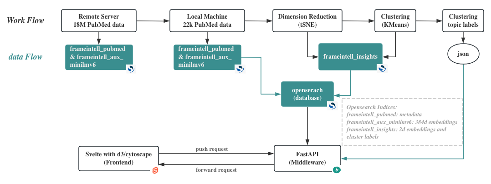
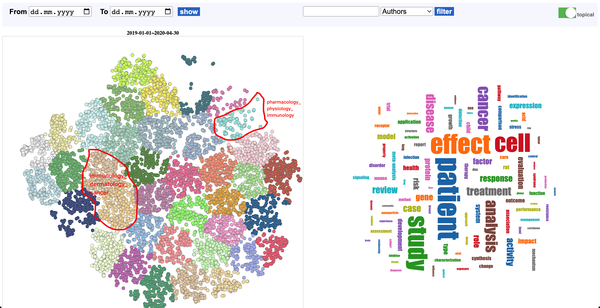
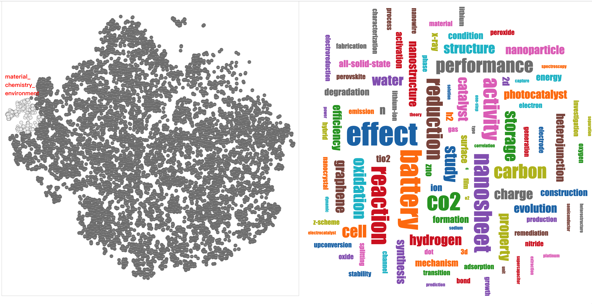
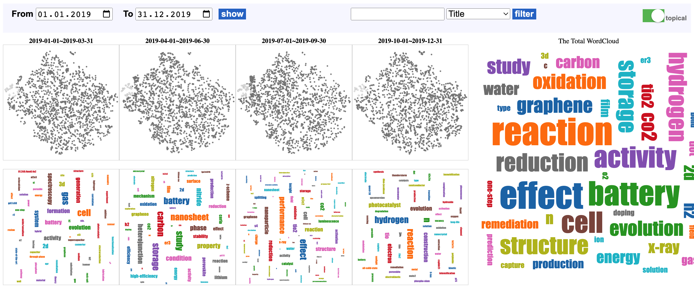
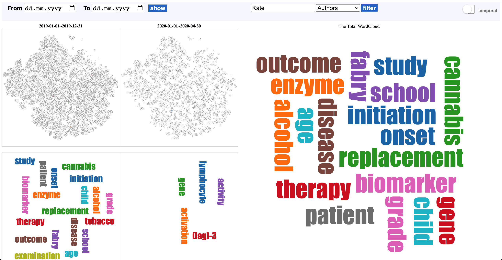
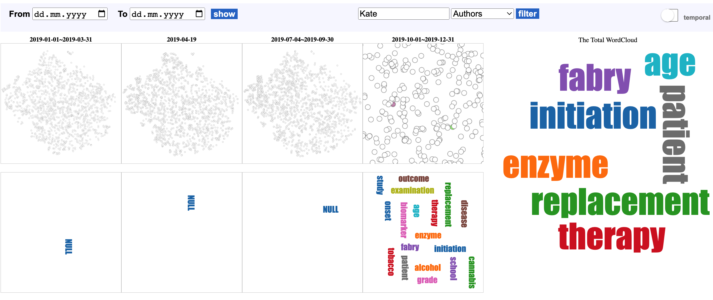
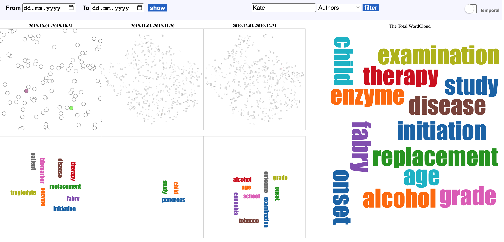

# Topic: Multi-Aspect Corpus Exploration
#### Author: [Qiaowen Hu](mailto:huqiaowen0104@163.com)
#### Supervisor: Ashish Chouhan

## Introduction
With a dataset containing around 18M PubMed abstract, this project aims to provide a pipeline for enabling users to explore the corpus on multiple aspects.

The project incorporates three core functionalities through a web service. Primarily, it offers a comprehensive global overview of the corpus' topics. Additionally, it provides temporal clustering of PubMed abstracts, enabling users to trace the progression of research trends over time. Lastly, it grants users the ability to explore the corpus based on distinct facets including paper title, abstracts, keywords, journals, affiliations and authors. This dynamic capability helps uncover new viewpoints and findings within the vast landscape of the PubMed corpus.

## Pipeline


* This project takes a prototype approach using 22k PubMed dataset. The dataset spans from 2019 to 2021, with 20 items being randomly selected for each day within this timeframe.
* The generated clustering topic labels are stored in the json file. The backend gets the topic labels from this json file.
* Skip the step of loading data to local machine if you install the project on the server machine with 18M PubMed data.

## Datasets(Indices)
`frameintell_pubmed`(given): metadata of PubMed corpus, including paper title, abstract, keywords, journals, authors, affiliations, etc.

`frameintell_aux_minilmv6`(given): PubMed abstracts are considered to create the embeddings. For each PubMed abstract an embedding of 384 dimensions are generated. The 384 dimension are obtained by passing the PubMed abstract through the [SBERT model](https://www.sbert.net/docs/pretrained_models.html) ([all_MiniLM_L6_v2](https://huggingface.co/nreimers/MiniLM-L6-H384-uncased)). The model takes the 256 sequence length of the PubMed abstract and provide an embedding of 384 dimensions.

`frameintell_insights`: 2d embeddings and cluster labels, a data example:
```
"insights": [{
    "dim_reduction_method": "tsne",
    "reduced_dimension": [
    -38.70474073056021,
    8.046013414330963
    ],
    "clustering_information": [{
        "clustering_method": "kmeans",
        "label": 31
    }]
}]
```

`frameintell_pubmed_words`(optional): tokens of paper title/abstract.

## Getting started

1. Dowload the project
    ```
    git clone https://git-dbs.ifi.uni-heidelberg.de/practicals/2023-qiaowen-hu.git
    ```
2. Start docker service 
    First, install OpenSearch with Docker Compose.(refer to https://opensearch.org/downloads.html)  
    Then, start the docker service.
    ``` 
    cd 2023-qiaowen-hu
    docker-compose up
    ```
    Open http://localhost:5601 and have a look!

3. Copy data from remote Server to local machine
    * open jupyter notebook
    * run the script `0-fetch_data_based_index.ipynb` to copy index `frameintell_aux_minilmv6`
    * run the script `0-fetch_data_based_ids.ipynb` to copy index `frameintell_pubmed`


4. Install dependencies
* Create virtual environment
    ```
    python3 -m venv myenv
    source myenv/bin/activate
    ```
* Install dependencies
    ```
    cd 2023-qiaowen-hu
    pip install -r requirements.txt
    ```
5. Prepare target data  
* generate the index `frameintell_insights` and cluster labels 
    - following the steps of [Getting started](algorithms/README.md#getting-started)

* generate the index `frameintell_pubmed_words`
    ```
    cd algorithms
    python 0-gen_tokens.py  
    ```

6. Start web service: following the steps in [website/README.md](website/README.md)

## Pipeline Features
### 1. Navigating Topic Landscapes: Unveiling Research Patterns
To begin with, upon entering the project website in the default topical mode, users are presented with the opportunity to explore the corpus' comprehensive distribution of topics/clusters and gain an overview of its content. 

Notably, some clusters may appear significantly larger than others, indicating a greater concentration of research within the corresponding subject areas of these larger clusters. For instance, the left cluster labeled as "immunology_dermatology_cancer" garners considerably more research interest when compared to the right cluster denoted as "pharmacology_physiology_immunology." (Zooming in reveals the specific topics.)


### 2. Delving Deeper: Exploring Specific Topic through Interactive Selection
Users might have an interest in a particular cluster. Each cluster stands for a particular topic. In such cases, they have the option to click on and choose the desired cluster to access more in-depth information of the corresponding topic. To illustrate, if a user is curious about a cluster labeled as "material_chemistry_environment", they can simply click on it to select the cluster. This action will lead them to a corresponding word cloud representing the topic, enabling them to obtain a broad overview of its content at a higher level of granularity. 


### 3. Tracing Topic Evolution: Investigating Changes Over Time
Moreover, users have the option to track the development of a topic over a specific timeframe. Continuing with the example of the "material_chemistry_environment" topic, users can observe that during the initial period, research focuses on keywords such as "battery," "gas," "spectroscopy," "generation," "evolution," and "system." However, as the timeline progresses into the second phase, there is a shift in research interest towards terms like "nanosheet," "carbon," "storage," and "condition". Subsequently, the third period centers around terms such as "nanoarticle," "performance," "effect," and "reaction," while the fourth phase highlights "hydrogen," "photocatalyst," "construction," "evolution," and "reaction."


### 4. Exploring Varied facets of the Corpus: Following Interests and Evolution 
Users have the opportunity to investigate multiple distinct dimensions of the corpus according to their interests or research fields. Similarly, they can gain a comprehensive temporal overview of a specific facet and track its evolution. For instance, if a user desires to delve into details about an author named "Kate," they can initiate a search for the author in the global temporal mode to obtain an overview, as shown below:


Upon delving deeper into the year 2019, it becomes apparent that "Kate" only published papers in the final quarter of that year.


Further examination at the month level reveals that in October 2019, "Kate" focused on topics such as "troglodyte," "biomarker," "therapy," and "fabry." Moving into November 2019, the research interests shifted towards "child," "pancreas," and "study." Finally, in December 2019, the focus turned to terms like "school," "age," "grade," "outcome," and "examination."


### 5. Enhancing Information Generation with RAG Tools
These information can be organized manually and then input into Retrieval Augmented Generation (RAG) tools like ChatGPT. This enables the generation of more comprehensive and detailed information based on the organized information. For example:

Prompt:
```
Author：Kate; 
in October 2019, "Kate" focused on topics such as "troglodyte," "biomarker," "therapy," and "fabry." 
Moving into November 2019, the research interests shifted towards "child," "pancreas," and "study." 
Finally, in December 2019, the focus turned to terms like "school," "age,") 
```

ChatGPT output:
```
In October 2019, the author Kate's work centered on various subjects including "troglodyte," "biomarker," "therapy," and "Fabry."
As the research progressed into November 2019, Kate's interests transitioned towards topics such as "child," "pancreas," and "study." 
By December 2019, the focus of Kate's research shifted to terms like "school" and "age." 
While the exact context and purpose of this research aren't provided, it's evident that Kate's exploration encompassed diverse subjects, 
ranging from medical and therapeutic concepts to educational and developmental aspects. The evolution of Kate's interests over these 
months suggests a versatile and possibly interdisciplinary approach to her work, although more information would be needed to comprehensively 
understand the significance and implications of her research during that period.
```

Likewise, users can apply a similar approach to explore other facets of the corpus. By tailoring their exploration to specific criteria or subjects of interest, they can uncover insights and trends that pertain to diverse aspects of the content. Just as in the example provided, where the evolution of "Kate's" contributions was examined, users can choose to delve into different attributes, researchers, or topics to glean a deeper understanding of their development over time. This capability not only facilitates a comprehensive exploration but also empowers users to make well-informed observations and draw meaningful conclusions from the corpus' rich dataset.

## Future work and limitations
- Currently, the project permits the exploration of a singular facet at any given time. Enabling users to simultaneously investigate two or more facets could significantly enhance its utility. For instance, users might wish to scrutinize a distinct research topic associated with a specific affiliation. To facilitate this, the project should incorporate the capability to search keywords within titles and/or abstracts while also providing filters for affiliations.

- In the current pipeline,the data needed for Retrieval Augmented Generation (RAG) must be created manually and then input into various tools to produce comprehensive details. In the future, it would be better to optimize the process by integrating RAG directly into the pipeline, which would enable users to access finalized information seamlessly, eliminating the need for separate manual steps.

- Although the prototype functions with a dataset of 22k records, its responsiveness during interactive use has been sluggish. Therefore, optimization efforts are imperative to ensure seamless functionality with much larger corpora.


## Reference
González-Márquez, R., Schmidt, L., Schmidt, B. M., Berens, P., & Kobak, D. (2023). The landscape of biomedical research.
