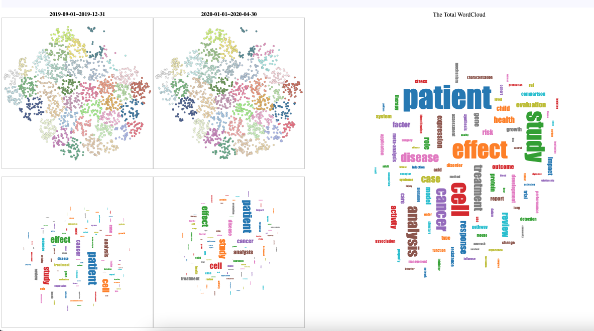

# Website: FastAPI+Svelte

## Configure
Create website/api-fast/config.py to connect opensearch
Establish a connection to an open search. This is the configuration file.
```
# create website/api-fast/config.py
host = '***'
port = ***
username = '***'
password = '***'
```

## Start service
1. Start backend service
```
cd website/api-fast
uvicorn main:app --reload
```
2. Start frontend service
```
cd website/frontend
npm install
npm install cytoscape d3 d3-cloud d3-scale-chromatic
npm run dev
```
open the website http://localhost:5173/ and have a look!

